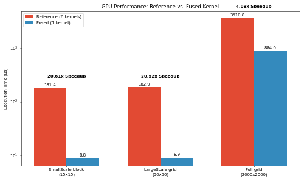

# gstatsMCMC-CuPy

GPU-accelerated Markov Chain Monte Carlo (MCMC) framework for geostatistical inference of subglacial bed topography. Built on [CuPy](https://cupy.dev/), [gstatsim_custom](https://github.com/badger-lord/gstatsim_gpu) and extending the [gstatsMCMC](https://github.com/NiyaShao/geostatisticalMCMC) implementation by Niya Shao, this project performs geostatistical Monte Carlo Markvo Chain method for inversion - entirely on the HPC of UF (L4 Turin GPUs and Blackwell B200s). 

## Key Features

- **Fused CUDA kernels for mass conservation** : Ice flux divergence and full mass balance residuals are computed in a single custom CUDA kernel.

- **On-GPU normal score transformation** : Quantile-based forward/inverse transforms keep data GPU-resident throughout the chain, referencing [sk-learn QuantileTransformer](https://scikit-learn.org/stable/modules/generated/sklearn.preprocessing.QuantileTransformer.html)
- **Memory-aware batching** : SGS batch sizes auto-tune based on available VRAM to maximize throughput without out-of-memory errors.
- **Multi-GPU parallelism** : Run independent MCMC chains across multiple GPUs with per-device process and batch scheduling.
- **Variogram models** : Supporting Matérn, Exponential, Gaussian, and Spherical covariance models with anisotropic rotation/scaling.

## Repository Structure

```
gstatsMCMC-CuPy/
├── MCMC_GPU/                          # Core GPU module
│   ├── MCMC_cu.py                     # MCMC chain class 
│   ├── MC_res.py                      # Fused CUDA kernel for mass conservation residuals
│   ├── SGS_GPU.py                     # Sequential Gaussian Simulation context manager
│   ├── QuantileTransformer_gpu.py     # GPU normal score transform
│   ├── Utilities.py                   # GPU utility functions
│   └── gstatsim_custom_gpu/           # Kriging & spatial statistics <><> From *Matthew Jones*
│       ├── _krige_gpu.py              # Batch kriging solver
│       ├── covariance_gpu.py          # Variogram model registry
│       ├── besselk_gpu.py             # Custom CUDA Bessel K function
│       ├── interpolate_gpu.py         # Neighbor-based kriging interpolation
│       ├── neighbors_gpu.py           # KDTree neighbor search & stencil generation
│       └── utilities_gpu.py           # Gaussian transform, memory tuning
├── scripts/
│   └── T4_GPU_SmallScaleChain.ipynb   # Tutorial notebook for running a single Small Scale Chain
├── smallScaleChain_multiprocessing_GPU.py  # Multi-GPU chain driver using multiprocessing + spawn context
├── data/
│   ├── Supprt_Force.csv               # Glacial survey data (coords, vel, bath, SMB,.. )
│   ├── bed_1000k.npy                  # Bed elevation after 1M LargeScaleChain iterations
│   ├── bed_2000k.npy                  # Bed elevation after 2M LargeScaleChain iterations
│   ├── 200_seeds.txt                  # RNG seeds for reproducible chains
│   └── data_weights_SF.txt            # Data weights / uncertainties
└── tests/                             # Unit and benchmark tests
    ├── test_mcmc_comparison.py        # Single Kernel in C vs. Normal CuPy (6 Kernel)
    ├── test_preprocess.py             # CuPy vs. Numpy
    ├── test_sgs.py                    # Test batch SGS vs. gstatsim
    └── test_quantile.py               # sklearn QT vs. CuPy QT wrapper
```

## Installation

### Prerequisites

- Python 3.12.11+
- NVIDIA GPU with CUDA 
- CUDA Toolkit 12.2+
- CUPY 13.4.1
- rapidsai/25.06

### Install dependencies

```bash
pip install cupy-cuda12x  # adjust for your CUDA version (e.g., cupy-cuda11x)
pip install numpy scipy pandas scikit-learn scikit-gstat verde

module load rapidsai/25.06 # HiPerGator
```

```bash
git clone https://github.com/tylerrleee/gstatsMCMC-CuPy
cd gstatsMCMC-CuPy
```

## Quick Start

```python
import cupy as cp
import pandas as pd
from MCMC_GPU.MCMC_cu import chain_sgs_gpu

# 1. Load data
df = pd.read_csv("data/Supprt_Force.csv")
xx = cp.array(df["x"].unique(), dtype=cp.float64)
yy = cp.array(df["y"].unique(), dtype=cp.float64)

# 2. Initialize chain
chain = chain_sgs_gpu(xx, yy, bed_init, ice_surface, velx, vely, smb, dhdt, ice_mask)

# 3. Configure
chain.set_variogram(model="matern", range_val=23.6, sill=0.44, shape=0.31)
chain.set_normal_transformation(quantile_transformer)
chain.set_trend(trend_surface)
chain.set_block_sizes(min_block=5, max_block=20)
chain.set_sgs_param(n_neighbors=48, search_radius=30_000)
chain.set_loss_type(sigma_mc=3.0)
chain.set_update_region(high_velocity_mask)

# 4. Run MCMC
chain.run(n_iterations=100_000)
```

For a complete walkthrough with data loading, variogram fitting, and result visualization, see **[`scripts/T4_GPU_SmallScaleChain.ipynb`](scripts/T4_GPU_SmallScaleChain.ipynb)**.

To run parallel chains across multiple GPUs:

```python
from smallScaleChain_multiprocessing_GPU import smallScaleChain_mp

smallScaleChain_mp(n_chains=8, n_gpus=4, seeds_file="data/200_seeds.txt")
```

